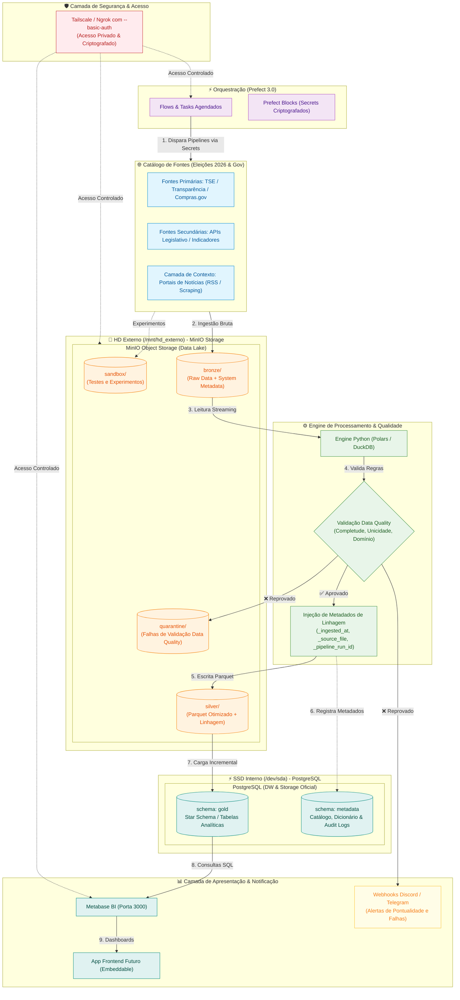

```mermaid
flowchart TD
    subgraph SEC[" 🛡️ Camada de Segurança & Acesso "]
        TAILSCALE["Tailscale / Ngrok com --basic-auth\n(Acesso Privado & Criptografado)"]
    end

    subgraph FONTES[" 🌐 Catálogo de Fontes (Eleições 2026 & Gov) "]
        F1["Fontes Primárias: TSE / Transparência / Compras.gov"]
        F2["Fontes Secundárias: APIs Legislativo / Indicadores"]
        F3["Camada de Contexto: Portais de Notícias (RSS / Scraping)"]
    end

    subgraph PREFECT[" ⚡ Orquestração (Prefect 3.0) "]
        ORQ["Flows & Tasks Agendados"]
        SECRETS["Prefect Blocks (Secrets Criptografados)"]
    end

    subgraph STORAGE_EXT[" 💾 HD Externo (/mnt/hd_externo) - MinIO Storage "]
        subgraph MINIO[" MinIO Object Storage (Data Lake) "]
            B_SANDBOX[("sandbox/\n(Testes e Experimentos)")]
            B_BRONZE[("bronze/\n(Raw Data + System Metadata)")]
            B_SILVER[("silver/\n(Parquet Otimizado + Linhagem)")]
            B_QUARANTINE[("quarantine/\n(Falhas de Validação Data Quality)")]
        end
    end

    subgraph ENGINE_DQ[" ⚙️ Engine de Processamento & Qualidade "]
        ENGINE["Engine Python (Polars / DuckDB)"]
        DQ_CHECK{"Validação Data Quality\n(Completude, Unicidade, Domínio)"}
        AUDIT["Injeção de Metadados de Linhagem\n(_ingested_at, _source_file, _pipeline_run_id)"]
    end

    subgraph STORAGE_SSD[" ⚡ SSD Interno (/dev/sda) - PostgreSQL "]
        subgraph DB_PG[" PostgreSQL (DW & Storage Oficial) "]
            DB_GOLD[("schema: gold\nStar Schema / Tabelas Analíticas")]
            DB_META[("schema: metadata\nCatálogo, Dicionário & Audit Logs")]
        end
    end

    subgraph SERVING[" 📊 Camada de Apresentação & Notificação "]
        METABASE["Metabase BI (Porta 3000)"]
        ALERT["Webhooks Discord / Telegram\n(Alertas de Pontualidade e Falhas)"]
        FRONTEND["App Frontend Futuro (Embeddable)"]
    end

    %% Conexões de Segurança
    TAILSCALE -.->|Acesso Controlado| METABASE
    TAILSCALE -.->|Acesso Controlado| MINIO
    TAILSCALE -.->|Acesso Controlado| ORQ

    %% Fluxo de Ingestão e Processamento
    ORQ -->|1. Dispara Pipelines via Secrets| FONTES
    FONTES -->|2. Ingestão Bruta| B_BRONZE
    FONTES -.->|Experimentos| B_SANDBOX

    B_BRONZE -->|3. Leitura Streaming| ENGINE
    ENGINE -->|4. Valida Regras| DQ_CHECK

    %% Caminhos de Qualidade de Dados
    DQ_CHECK -- "❌ Reprovado" --> B_QUARANTINE
    DQ_CHECK -- "❌ Reprovado" --> ALERT

    DQ_CHECK -- "✅ Aprovado" --> AUDIT
    AUDIT -->|5. Escrita Parquet| B_SILVER
    AUDIT -.->|6. Registra Metadados| DB_META

    %% Carga Analítica e BI
    B_SILVER -->|7. Carga Incremental| DB_GOLD
    DB_GOLD -->|8. Consultas SQL| METABASE
    METABASE -->|9. Dashboards| FRONTEND

    %% Estilização por Bloco
    classDef sec fill:#ffebee,stroke:#c62828,stroke-width:1px,color:#b71c1c;
    classDef fontes fill:#e1f5fe,stroke:#0288d1,stroke-width:1px,color:#01579b;
    classDef pref fill:#f3e5f5,stroke:#ab47bc,stroke-width:1px,color:#4a148c;
    classDef storage fill:#fff3e0,stroke:#f57c00,stroke-width:1px,color:#e65100;
    classDef proc fill:#e8f5e9,stroke:#388e3c,stroke-width:1px,color:#1b5e20;
    classDef db fill:#e0f2f1,stroke:#00897b,stroke-width:1px,color:#004d40;
    classDef alert fill:#fffde7,stroke:#fbc02d,stroke-width:1px,color:#f57f17;

    class TAILSCALE sec;
    class F1,F2,F3 fontes;
    class ORQ,SECRETS pref;
    class B_SANDBOX,B_BRONZE,B_SILVER,B_QUARANTINE storage;
    class ENGINE,DQ_CHECK,AUDIT proc;
    class DB_GOLD,DB_META,METABASE,FRONTEND db;
    class ALERT alert;
```
